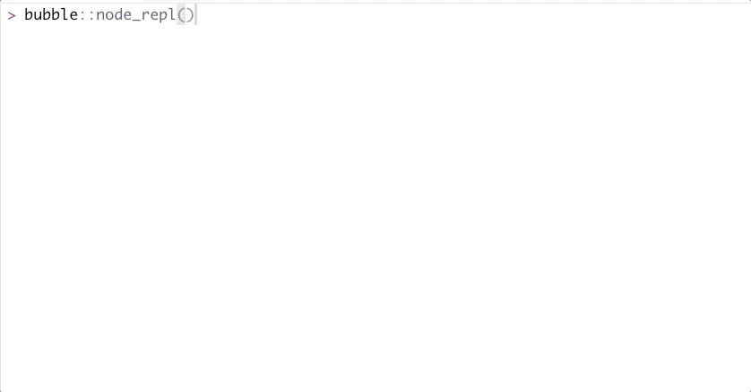

<!-- README.md is generated from README.Rmd. Please edit that file -->

# bubble

<!-- badges: start -->

<!-- badges: end -->

The goal of `{bubble}` is to launch and interact with a NodeJS session,
from R.

## Installation

You can install the dev version of `{bubble}` with:

``` r
remotes::install_github("colinfay/bubble")
```

## Example

### Using bubble to launch and communicate with a NodeJS session

``` r
library(bubble)

n <- NodeSession$new( bin = "/usr/local/bin/node" )
n$eval("var x = 12")
#> undefined
n$eval("var y = 17")
#> undefined
n$eval("x + ")
n$eval("y")
#> 29
x <- n$get("x")
y <- n$get("y")
class(x)
#> [1] "integer"
class(y)
#> [1] "integer"
y + x
#> [1] 29
n$state()
#> [1] "running"
n$kill()
#> [1] TRUE
n$state()
#> [1] "terminated"
n$kill()
#> Process already terminated
```

### Using {bubble} to launch an express app

``` r
n <- NodeSession$new( bin = "/usr/local/bin/node")

n$eval("const express = require('express');")
#> undefined
n$eval("app = express()", print = FALSE)

n$eval("app.get('/', function (req, res) {")
n$eval("  res.send('Hello R!')")
n$eval("})", print = FALSE)
n$eval("app.listen(3000)", print = FALSE)

x <- httr::GET("http://127.0.0.1:3000") 
httr::content(x)
#> {html_document}
#> <html>
#> [1] <body><p>Hello R!</p></body>
n$kill()
#> [1] TRUE
```

### Using {bubble} to launch a NodeJS terminal

``` r
node_repl()
```



### Using {bubble} to launch a NodeJS script

``` r
n <- NodeSession$new( 
  bin = "/usr/local/bin/node", 
  params = system.file(
    "launch.js", 
    package = "bubble"
  )
)
x <- httr::GET("http://127.0.0.1:3000") 
httr::content(x)
#> {html_document}
#> <html>
#> [1] <body><p>Hello R!</p></body>
n$kill()
#> Process already terminated
```
